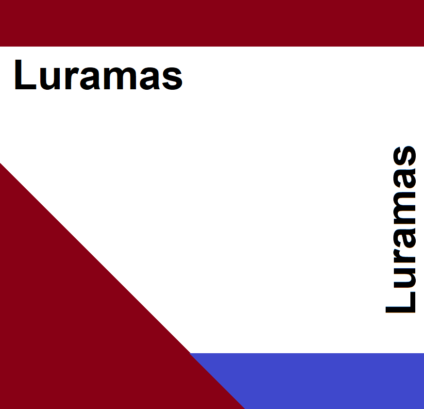

# THIS IS AN ALPHA RELEASE EXPECT BUGS!

This is an **alpha** release of Luramas. This does not mean bugs will not be fixed, they are being fixed.
If you find any bugs report it in issues. This is a limited release of luramas. Again expect bugs and stuff to be unfinished!
[TODO list](TODO.md)

# Luramas

## Description

Luramas is a retargetable decompiler and bytecode manipulation framework for different multiple interpreted languages.
This project was originally intended too focus on making a decompiler for lua and multiple forks of lua without the use of any debugger information but slowly evolved into Luramas.
A lot of the keywords are derived lua's internals but they apply too every language supported by the decompiler.
Luramas comes with a bunch of manipulation tools, disassembler, versitile intermediate language, and a decompiler for each language.

## Purpose

There a lot of different decompilers out there for most of the languages and versions supported but they each have there own problems. 
This project is too generalize a lot of different interpreted languages into a common format for easy decompilation, disassembly, and manipulation. 
Thought most decompilers out there are decent this is designed to have a fully user customizable output format and language syntax 
retargetability while also generating a very good high level representation of the original code.
Luramas features its own **IL Bytecode** which is designed to be very flexible among the supported interpreted languages,
different to LLVM this does not provide the same level of optimization as LLVM.
It does generate **LLVM-IR** which can be optimized then lifted to your target language syntax.
With its diverse IL it is possible to lift and decompile obscure interpreted languages that may not have a proper decompiler and or disassembler while also
generating a very clean and flexible output. The reason why the IL exists is to be very flexible around many different intepreted languages.

## Pre-requisites

* **LLVM 14.0.4**

## Support

Luramas supported languages and versions can be found in [docs/support.md](Luramas/docs/support.md)

## Documentation

Documentation can be found in [docs/framework.md](Luramas/docs/framework.md)

## Example Usage

Each example shows how you can generate: **IL**, **IR**, **AST**, and **code**.

### Change Target (Lua 5.4 is set by default):

Too change decompilation target:

#### Visual Studio

**1)** Right click project and press **Clean**.

**2)** Go too **3rdparty** [folder](Luramas/3rdparty/) and pick which fork of lua is your target.

**3)** Collapse the folder and right click on the version and press **Include In Project**.

**4)** If you switched targets before what ever was your last target right click on the folder and press **Exclude from Project**.

**5)** **For your first time changing target** **Lua_5.4** is included by default, go too [3rdparty/lua](Luramas/3rdparty/lua/), collapse it, go too the [Lua_5.4](Luramas/3rdparty/lua/Lua_5.4) and press **Exclude from Project**.

**6)** You need too change target config for the framework for what version you are using todo that go too [framework/target/target.hpp](Luramas/framework/target/target.hpp)

**7)** In there you should see only one macro replace the value of the macro with the config of the target type, for more details open it up and read the comment.

## Help
 
If you find a bug with it or something that can be added let me know in **Issues**.

## UI 

[STILL WORK IN PROGRESS(WIP)] -> Graphical implementation of Luramas and interactive disassembler for multiple interperted languages can be found [here](https://github.com/Paxsma/Guramas/).